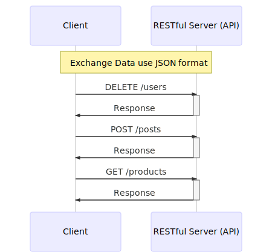
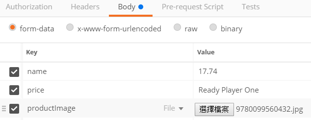
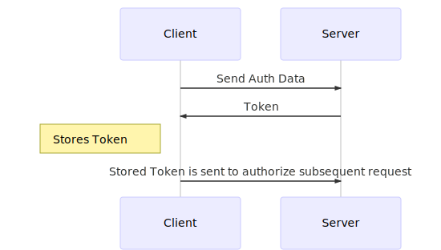
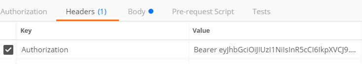

# RESTful API Example
Implement a shop RESTful API follow [Creating a REST API with Node.js] tutorial series.

[Creating a REST API with Node.js]: https://www.youtube.com/playlist?list=PL55RiY5tL51q4D-B63KBnygU6opNPFk_q

## Table of Contents

<!-- toc -->

- [What is a RESTful API?](#what-is-a-restful-api)
  * [RESTful Constraints](#restful-constraints)
- [Setup](#setup)
  * [JavaScript framework](#javascript-framework)
- [Planning & Adding Routes](#planning--adding-routes)
- [Handling Errors](#handling-errors)
- [Request Body Parsing](#request-body-parsing)
- [Handling CORS](#handling-cors)
- [MongoDB and Mongoose](#mongodb-and-mongoose)
  * [MongoDB Atlas](#mongodb-atlas)
  * [Mongoose](#mongoose)
    + [connect to DB](#connect-to-db)
    + [Data Schema](#data-schema)
    + [writing Data to DB](#writing-data-to-db)
    + [Read data from DB](#read-data-from-db)
    + [get All data from DB](#get-all-data-from-db)
    + [Remove data in DB](#remove-data-in-db)
    + [Update data in DB](#update-data-in-db)
- [Mongoose Validation](#mongoose-validation)
- [Populating Queries with Mongoose](#populating-queries-with-mongoose)
- [Uploading an Image](#uploading-an-image)
  * [Multer Storage Strategy](#multer-storage-strategy)
  * [Access Image](#access-image)
- [Adding User Signup](#adding-user-signup)
  * [How Authorization Works](#how-authorization-works)
  * [JSON Web Token](#json-web-token)
  * [Password Hashing With Salt](#password-hashing-with-salt)
  * [User Model](#user-model)
  * [User Routes](#user-routes)
- [Adding User Login & JWT Signing](#adding-user-login--jwt-signing)
  * [Create Json Web Token](#create-json-web-token)
- [JWT Route Protection](#jwt-route-protection)
- [Adding Controllers](#adding-controllers)

<!-- tocstop -->

---

## What is a RESTful API?

**Client(Mobile App)** : Stores and Fetches Data but doesn't use/render HTML
**Client(Code)** : Access third-party features (e.g. Google Geolocation API)
**Client(Browser w/ SPA)** : Stores and Fetches Data but never renders a second HTML page

</img>

### RESTful Constraints
- **Client-Server Architecture** : Separation of Concerns.RESTful API Should not care about the UI.
- **Stateless** : No Client-Context(e.g. Session) is stored on the Server
- **Cacheability** : Responses must define themselves as cacheable or non-cacheable.
- **Layered System** : Intermediate Servers maybe used without the Client knowing about it.
- **Unifrom Interface** : Resources are identified in Requests, transferred data is decoupled from db schema. Self-descriptive Messages Links to further Resources.
- **Code On Demand**(optionl) : Executuld Code could be transferred.

---

## Setup
- Node.js : A JavaScript runtime built on Chrome's V8 JavaScript engine.
- MongoDB : A free and open-source cross-platform document-oriented database program. Classified as a NoSQL database program, MongoDB uses JSON-like documents with schemas.
- Postman : The most complete toolchain for API development
- npm : The package manager for JavaScript and the world's largest software registry.

### JavaScript framework
- express : Fast, unopinionated, minimalist web framework for node.
- morgan : HTTP request logger middleware for node.js
- body-parser : Parse incoming request bodies in a middleware before your handlers
- nodemon : A utility that will monitor for any changes in your source and automatically restart your server.
- mongoose : a MongoDB object modeling tool designed to work in an asynchronous environment.
- Multer : Node.js middleware for handling `multipart/form-data`.
- bcrypt : Lib to help you hash passwords.
- jsonwebtoken : An implementation of JSON Web Tokens.

---

## Planning & Adding Routes
|Endpoint|HTTP Method(Status code)|
|:-:|:-:|
|/products|GET(200) <span style="color:red;">POST(201)</span>|
|/products/{id}|GET(200) <span style="color:red;">PATCH(200) DELETE(200)</span>|
|/orders|<span style="color:red;">GET(200) POST(201)</span>|
|/orders/{id}|<span style="color:red;">GET(200) DELETE(200)</span>|
> Red part are protected.Only loginned user can access them.

---

## Handling Errors
In **app.js**,add error handling middleware after routes :
```js
//Routes
app.use('/products',productsRoutes)
app.use('/orders',ordersRoutes)

//Request Error Handling (404)
app.use((req,res,next)=>{
  const error = new Error('Note found')
  error.status = 404
  //forward this error request here
  //instead of the original one essentially.
  next(error)
})

//All Error Handling response
app.use((error,req,res,next)=>{
  res.status(error.status || 500)
  res.json({
    error: {
      message: error.message
    }
  })
})
```
The code `next(error)` will forward the request, but forward error request instead of the original one essentially.

---

## Request Body Parsing
In **app.js**,use `body-parser` module to limit and parse incoming requests, declare them before adding routes:
```js
const bodyParser = require('body-parser')
...
...
//Request body parser middleware
app.use(bodyParser.urlencoded({extended: false}))
app.use(bodyParser.json())

//Routes
app.use('/products',productsRoutes)
app.use('/orders',ordersRoutes)

```

In **products.js**, get new product info from `req.body` then send response that contain created info :
```js
/*POST /products*/
router.post('/', (req,res,next)=>{
  const product = {
    name: req.body.name,
    price: req.body.price
  }
  //201 Created
  res.status(201).json({
    msg:'POST /products',
    createProduct: product
  })
})
```

In **orders.js**, get new order info from `req.body` then send response that contain the order info :
```js
/*POST /orders*/
router.post('/', (req,res,next)=>{
  const order = {
    productId: req.body.productId,
    quantity:req.body.quantity
  }
  //201 Created
  res.status(201).json({
    msg:'POST /orders',
    order:order
  })
})
```

---

## Handling CORS
 A user agent need to makes a **cross-origin HTTP request** when it requests a resource from a different domain, protocol, or port than the one from which the current document originated.
> see https://developer.mozilla.org/en-US/docs/Web/HTTP/CORS

In **app.js**, add CORS Handling middleware before Routes.Declare `Access-Control-Allow-Origin`, `Access-Control-Allow-Headers` and `Access-Control-Allow-Methods` in response header to prevent CORS errors :
```js
//Request body parser middleware
app.use(bodyParser.urlencoded({extended: false}))
app.use(bodyParser.json())

//CORS Handling
app.use((req,res,next)=>{
  let prefix = 'Access-Control-Allow-'
  res.header(prefix+'Origin', '*')
  res.header(prefix+'Headers',
  'Origin, X-Requested-With, Content-Type, Accept, Authorization')

  if(req.method === 'OPTIONS'){
    res.header(prefix+'Methods',
    'PUT, POST, PATCH, DELETE, GET')
    //Use `return` because don't need to go to Routes
    return res.status(200).json({})
  }

  //end Handling,pass to next middleware
  next()
})

//Routes
app.use('/products',productsRoutes)
app.use('/orders',ordersRoutes)
```

---

## MongoDB and Mongoose
### MongoDB Atlas
- apply & create a Cluster use MongoDB Atlas
- add Admin account for your Cluster
- add whitelist Entry (Allow Access from Anywhere)
- get URI connection string

### Mongoose

#### connect to DB
First,set DB account in `nodemon.json`, then create connection use `mongoose.connect()` in `app.js`:
```json
/*nodemon.json*/
{
  "env":{
    "DB_REMOTE_USER":"YOUR_ADMIN_NAME",
    "DB_REMOTE_PW":"YOUR_ADMIN_PASSWORD",
    "DB_REMOTE_HOST":"YOUR_ClUSTER_HOST"
  }
}
```
```js
const {DB_REMOTE_USER,DB_REMOTE_PW,DB_REMOTE_HOST} = process.env
mongoose.connect(`mongodb://${DB_REMOTE_USER}:${DB_REMOTE_PW}@${DB_REMOTE_HOST}/test?ssl=true&replicaSet=shop-restful-api-shard-0&authSource=admin`)
```

#### Data Schema
Create `Schema` & `Model` of product :
```js
/* ./api/models/product.js */
const mongoose = require('mongoose');

const productSchema = mongoose.Schema({
  _id: mongoose.Schema.Types.ObjectId,
  name: String,
  price: Number
})

module.exports = mongoose.model('Product',productSchema);
```

#### writing Data to DB
Implement writing new product data to DB in `Products` Route :
```js
const mongoose = require('mongoose')
/*mongoose Model*/
const ProductModel = require('../models/product')
...
...
/*POST /products*/
router.post('/', (req,res,next)=>{
  const product = new ProductModel({
    _id:new mongoose.Types.ObjectId(),
    name: req.body.name,
    price: req.body.price
  })

  product.save().then((result)=>{
    console.log(result)
    //201 Created
    res.status(201).json({
      msg:'POST /products',
      createProduct: result
    })
  }).catch((err)=>{
    console.log(err)
    res.status(500).json({error:err})
  })
})
```
Use Postman sending `POST /products` request,then get the response :
```JSON
/*request.body*/
{
  "name": "Harry Potter 5",
  "price": 12.99
}
```
```JSON
/*response*/
{
    "msg": "POST /products",
    "createProduct": {
        "_id": "5ad35d45ce53722b9016b943",
        "name": "Harry Potter 5",
        "price": 12.99
    }
}
```

#### Read data from DB
Implement read product data from DB in `Products` Route :
```js
/*GET /products/{id}*/
router.get('/:productId', (req,res,next)=>{
  const {productId} = req.params

  ProductModel.findById(productId).exec()
  .then((doc)=>{
    console.log(doc)
    if(doc){
      res.status(200).json({
        msg:`GET /products/${productId}`,
        product:doc
      })
    }else{
      res.status(404).json({msg:'No valid entry found for provided ID'})
    }
  }).catch((err)=>{
    console.log(err)
    res.status(500).json({error:err})
  })
})
```
Use Postman sending `GET /products/5ad35d45ce53722b9016b943` request,then get the response :
```JSON
{
    "msg": "GET /products/5ad35d45ce53722b9016b943",
    "product": {
        "_id": "5ad35d45ce53722b9016b943",
        "name": "Harry Potter 5",
        "price": 12.99,
        "__v": 0
    }
}
```

#### get All data from DB
Implement get All products data from DB in `Products` Route :
```js
/*GET /products*/
router.get('/', (req,res,next)=>{
  ProductModel.find().exec()
  .then((docs)=>{
    console.log(docs)
    res.status(200).json({
      msg:'GET /products',
      products:docs
    })
  })
  .catch((err)=>{
    console.log(err)
    res.status(500).json({error:err})
  })
})
```
Use Postman sending `GET /product` request,then get the response :
```JSON
{
    "msg": "GET /products",
    "products": [
        {
            "_id": "5ad35d45ce53722b9016b943",
            "name": "Harry Potter 5",
            "price": 12.99,
            "__v": 0
        }
    ]
}
```

#### Remove data in DB
Implement remove product data in DB in `Products` Route :
```js
/*DELETE /products/{id}*/
router.delete('/:productId', (req,res,next)=>{
  const {productId} = req.params
  ProductModel.remove({_id:productId}).exec()
  .then((result)=>{
    console.log(result)
    res.status(200).json({
      msg: 'delete product ' + productId,
      result: result
    })
  })
  .catch((err)=>{
    console.log(err)
    res.status(500).json({error:err})
  })
})
```
Use Postman sending `DELETE /products/5ad35d45ce53722b9016b943` request,then get the response :
```json
{
  "msg": "delete product 5ad35d45ce53722b9016b943",
  "result": {
    "n": 1,
    "opTime":{
       "ts": {
         "_bsontype": "Timestamp",
         "low_": 1,
         "high_": 1523806208
       },
       "t": 1
     },
    "electionId": "7fffffff0000000000000001",
    "ok": 1
  }
}
```

#### Update data in DB
Implement Update product data in DB in `Products` Route :
```js
/*PATCH /products/{id}*/
router.patch('/:productId', (req,res,next)=>{
  const {productId} = req.params
  const updateOps = {}
  for (const ops of req.body){
    updateOps[ops.propName] = ops.value
  }
  ProductModel.update({_id:productId},{$set:updateOps}).exec()
  .then((result)=>{
    console.log(result)
    res.status(200).json({
      msg: 'update product ' + productId,
      result: result
    })
  }).catch((err)=>{
    console.log(err)
    res.status(500).json({error:err})
  })
})
```
Use Postman sending `PATCH /products/5ad35d45ce53722b9016b943` request,then get the response :
```json
/*request.body*/
[
	{"propName":"name","value":"Harry Potter 6"}
]
```
```json
/*response*/
{
    "msg": "update product 5ad37792ae4c8c227c063b9b",
    "result": {
        "n": 1,
        "nModified": 1,
        "opTime": {
            "ts": "6544707114521067521",
            "t": 1
        },
        "electionId": "7fffffff0000000000000001",
        "ok": 1
    }
}
```

---

## Mongoose Validation
Add Validation in `mongoose.Schema` :
```js
const mongoose = require('mongoose');

const productSchema = mongoose.Schema({
  _id: mongoose.Schema.Types.ObjectId,
  name: {type:String,required:true},
  price: {type:Number,required:true}
})

module.exports = mongoose.model('Product',productSchema);
```
Define custom structure of response in Route :
```js
/*GET /products*/
router.get('/', (req,res,next)=>{
  ProductModel.find().select("name price _id").exec()
  .then((docs)=>{
    let response = {
      count:docs.length,
      products:docs.map((doc)=>{
        return {
          name:doc.name,
          price:doc.price,
          _id:doc._id,
          request:{
            type:'GET',
            url:`http://localhost:3000/products/${doc._id}`
          }
        }
      })
    }
    res.status(200).json(response)
  })
  .catch((err)=>{
    console.log(err)
    res.status(500).json({error:err})
  })
})
```

---

## Populating Queries with Mongoose
In `Order` Schema, property `product` refer `Product` ObjectId:
```js
const mongoose = require('mongoose');

const orderSchema = mongoose.Schema({
  _id: mongoose.Schema.Types.ObjectId,
  product: {type:mongoose.Schema.Types.ObjectId,ref:'Product',required:true},
  quantity: {type:Number, default:1}
})

module.exports = mongoose.model('Order',orderSchema);
```
In general,You only see `product._id` in order data :
```js
/*GET /orders*/
router.get('/:orderId', (req,res,next)=>{
  const {orderId} = req.params
  OrderModel.findById(orderId).exec()
  .then((doc)=>{
    if(doc){
      let response = {
        productId:doc.product,//product._id
        quantity:doc.quantity,
        _id:doc._id,
        request:{
          type:'GET',
          url:`http://localhost:3000/orders/${doc._id}`
        }
      }
      res.status(200).json(response)
    }else{
      res.status(404).json({msg:'No valid entry found for provided ID'})
    }
  }).catch((err)=>{
    res.status(500).json({error:err})
  })
})
```
```JSON
/*response*/
{
    "productId": "5ad37792ae4c8c227c063b9b",
    "quantity": 20,
    "_id": "5ad4dbc506997c215cb8bcae",
    "request": {
        "type": "GET",
        "url": "http://localhost:3000/orders/5ad4dbc506997c215cb8bcae"
    }
}
```
If use `populate()` method, you can populate the referred product data  (using second argument to select properties what you want) into `order.product` property :
```js
/*GET /orders/{id}*/
router.get('/:orderId', (req,res,next)=>{
  const {orderId} = req.params
  OrderModel.findById(orderId)
  .populate('product','name price _id')//Populate product data
  .exec()
  .then((doc)=>{
    if(doc){
      let response = {
        product:doc.product,//product data
        quantity:doc.quantity,
        _id:doc._id,
        request:{
          type:'GET',
          url:`http://localhost:3000/orders/${doc._id}`
        }
      }
      res.status(200).json(response)
    }else{
      res.status(404).json({msg:'No valid entry found for provided ID'})
    }
  }).catch((err)=>{
    res.status(500).json({error:err})
  })
})
```
```JSON
/*response*/
{
    "product": {
        "_id": "5ad37792ae4c8c227c063b9b",
        "name": "Harry Potter 6",
        "price": 12.99
    },
    "quantity": 20,
    "_id": "5ad4dbc506997c215cb8bcae",
    "request": {
        "type": "GET",
        "url": "http://localhost:3000/orders/5ad4dbc506997c215cb8bcae"
    }
}
```

---

## Uploading an Image
Use `Multer` middleware to process file uploading by `multipart/form-data` Content type.

First,create an upload middleware and specify a folder to store uploaded file :
```js
const multer = require('multer')
//do not use /uploads/
const upload = multer({dest:'uploads/'})
```
In Route, add the middleware and use `single()` method to define a field name`productImage` as below :
```js
router.post('/', upload.single('productImage'),(req,res,next)=>{
  console.log(req.file)
  ...
  ...
})
```
Use Postman sending form-data as below :
</img>

If success, you will get `request.body.name`, `request.body.price`and `request.file`.The uploaded binary file will stored in the folder.

The request property `file` data structure as below :
```js
req.file = { fieldname: 'productImage',
  originalname: '9780099560432.jpg',
  encoding: '7bit',
  mimetype: 'image/jpeg',
  destination: 'uploads/',
  filename: '0d04a8e9b23f871cfb0d391fbd563d46',
  path: 'uploads\\0d04a8e9b23f871cfb0d391fbd563d46',
  size: 28736 }
```

### Multer Storage Strategy
- Use `multer.diskStorage()` method to decide store destination path & uploaded file name.
- Use options `limits.fileSize` & `fileFilter` to restrict file size & mimetype.
```js
/*Multer Storage Strategy*/
const storage = multer.diskStorage({
  destination: function (req, file, cb){
    cb(null,'./uploads/')
  },
  filename: function (req, file, cb){
    const now = new Date().toISOString()
    //Windows does not accept filenames with colon (':')
    const date = now.replace(/:/g, '-')//replace : to -
    cb(null, date + file.originalname)
  }
})
const fileFilter = (req, file, cb)=>{
  const {mimetype} = file
  console.log(mimetype)
  const isJPEG = mimetype === 'image/jpeg'
  const isPNG = mimetype === 'image/png'
  if(isJPEG || isPNG) {
    cb(null, true)
  }else{
    cb(new Error(`Only support image/jpeg & image/png.`), false)
  }
}
const upload = multer({
  storage:storage,
  limits:{
    fileSize: 1024*1024*5 //5MB
  },
  fileFilter:fileFilter
})
```

### Access Image
In `app.js`,use the `express.static()` middleware let storage folder can be accessed :
```js
//static
app.use('/uploads',express.static('uploads'))
```

In `Product` Schema, add `productImage` property :
```js
const mongoose = require('mongoose');

const productSchema = mongoose.Schema({
  _id: mongoose.Schema.Types.ObjectId,
  name: {type:String,required:true},
  price: {type:Number,required:true},
  productImage:{type:String,required:true}
})

module.exports = mongoose.model('Product',productSchema);
```
Then Add `productImage` property in `products` Route :
**POST /products**
```js
/*POST /products*/
router.post('/', upload.single('productImage'),(req,res,next)=>{
  console.log(req.file)
  const product = new ProductModel({
    _id:mongoose.Types.ObjectId(),
    name: req.body.name,
    price: req.body.price,
    productImage: req.file.path
  })

  product.save().then((result)=>{
    let response = {
      name:result.name,
      price:result.price,
      productImage:result.productImage,
      _id:result._id,
      request:{
        type:'POST',
        url:`http://localhost:3000/products/${result._id}`
      }
    }
    //201 Created
    res.status(201).json(response)
  }).catch((err)=>{
    console.log(err)
    res.status(500).json({error:err})
  })
})
```
**GET /products**
```js
/*GET /products*/
router.get('/', (req,res,next)=>{
  ProductModel.find().select("name price productImage _id").exec()
  .then((docs)=>{
    let response = {
      count:docs.length,
      products:docs.map((doc)=>{
        return {
          name:doc.name,
          price:doc.price,
          productImage:doc.productImage,
          _id:doc._id,
          request:{
            type:'GET',
            url:`http://localhost:3000/products/${doc._id}`
          }
        }
      })
    }
    res.status(200).json(response)
  })
  .catch((err)=>{
    console.log(err)
    res.status(500).json({error:err})
  })
})
```
**GET /products/{id}**
```js
/*GET /products/{id}*/
router.get('/:productId', (req,res,next)=>{
  const {productId} = req.params

  ProductModel.findById(productId).select("name price _id productImage").exec()
  .then((doc)=>{
    if(doc){
      let response = {
        name:doc.name,
        price:doc.price,
        productImage:doc.productImage,
        _id:doc._id,
        request:{
          type:'GET',
          url:`http://localhost:3000/products/${doc._id}`
        }
      }
      res.status(200).json(response)
    }else{
      res.status(404).json({msg:'No valid entry found for provided ID'})
    }
  }).catch((err)=>{
    console.log(err)
    res.status(500).json({error:err})
  })
})
```

---

## Adding User Signup

### How Authorization Works
</img>

### JSON Web Token
- JSON Data with Signature is JSON Web Token.
- Signature can be verified
- JSON Data Typically Not Encrypted

### Password Hashing With Salt
Use `bcrypt` Implement Password Hashing With Salt.

> In cryptography, a salt is random data that is used as an additional input to a one-way function that "hashes" data, a password or passphrase. Salts are closely related to the concept of nonce. The primary function of salts is to defend against dictionary attacks or against its hashed equivalent, a pre-computed rainbow table attack.
> &mdash;<cite>[Salt (cryptography)](https://en.wikipedia.org/wiki/Salt_(cryptography))  @ Wikipedia</cite>

### User Model
Define `User` Schema as follow :
```js
const mongoose = require('mongoose');

const userSchema = mongoose.Schema({
  _id: mongoose.Schema.Types.ObjectId,
  email:{type:String,
    required:true,
    unique:true,
    match:/[a-z0-9!#$%&'*+/=?^_`{|}~-]+(?:\.[a-z0-9!#$%&'*+/=?^_`{|}~-]+)*@(?:[a-z0-9](?:[a-z0-9-]*[a-z0-9])?\.)+[a-z0-9](?:[a-z0-9-]*[a-z0-9])?/
  },
  password:{type:String, required:true}
})

module.exports = mongoose.model('User',userSchema);
```
The "unique" option simply optimizes this field. you could say to be searched and to be indexed .it can do some performance optimizations.

The "match" option use regular expression for validating email address (See https://stackoverflow.com/a/1373724/5455953).

### User Routes
Then Create `/signup` Endpoint on `user` Route.
There must do two things before create a new user into DB :
- Checking account is exist or not.Only "Not Exist" can create a new user.Use `409 Conflict` or `422 Unprocessable Entity` status to response if account is exist.
- Hashing `res.body.password` with Salt then save its hash value to DB.
```js
router.post('/signup',(req,res,next)=>{
  UserModel.find({email:req.body.email}).exec()
  .then((users)=>{
    if(users.length >= 1) {
      //409 Conflict or 422 Unprocessable Entity
      return res.status(409).json({
        message:'Account exists.'
      })
    }else{
      return bcrypt.hash(req.body.password, 10)
    }
  }).then((hash)=>{
    const user = new UserModel({
      _id:new mongoose.Types.ObjectId(),
      email:req.body.email,
      password:hash
    })
    return user.save()
  }).then((result)=>{
    let response = {
      user:result,
      request:{
        type:'POST',
        url:`http://localhost:3000/user/${result._id}`
      }
    }
    //201 Created
    res.status(201).json(response)
  }).catch((err)=>{
    res.status(500).json({error:err})
  });
})
```

Add "Remove User" feature as below :
```js
/*DELETE /user/{id}*/
router.delete('/:userId',(req,res,next)=>{
  const {userId} = req.params
  UserModel.remove({_id:userId}).exec()
  .then((result)=>{
    let response = {
      ts:Object.assign({},result.opTime.ts),
      request:{
        type:'DELETE',
        url:`http://localhost:3000/user/${userId}`
      }
    }
    res.status(200).json(response)
  })
  .catch((err)=>{
    res.status(500).json({error:err})
  })
})
```

---

## Adding User Login & JWT Signing
Create `/login` Endpoint on `user` Route.
There must do verify before create a Json Web Token:
- Checking account is exist or not.Only "Exist" can go to next step.
- Checking password use `bcrypt.compare(password,hash)` to verify.
- Use `401 Unauthorized` status to response if Auth failed.
```js
/*POST /user/login*/
router.post('/login',(req,res,next)=>{
  UserModel.find({email:req.body.email}).exec()
  .then((users)=>{
    if(users.length < 1){
      //401 Unauthorized
      return res.status(401).json({
        message:'Auth failed'
      })
    }else{
      return bcrypt.compare(req.body.password, users[0].password)
    }
  }).then((result)=>{
    if(!result){
      //401 Unauthorized
      return res.status(401).json({
        message:'Auth failed'
      })
    }else{
      return res.status(200).json({
        message:'Auth succesful'
      })
    }
  }).catch((err)=>{
    res.status(500).json({error:err})
  })
})
```

### Create Json Web Token
Use `jsonwebtoken` module to Create Json Web Token.
- The payload cotain `email` & `userId`.
- Secret Or PrivateKey from `nodemon.json`
- set expires of Token
```js
/*POST /user/login*/
router.post('/login',(req,res,next)=>{
  UserModel.find({email:req.body.email}).exec()
  .then((users)=>{
    if(users.length < 1){
      //401 Unauthorized
      return res.status(401).json({
        message:'Auth failed'
      })
    }else{
      const verifyResult = bcrypt.compareSync(req.body.password, users[0].password)
      if(!verifyResult){
        //401 Unauthorized
        return res.status(401).json({
          message:'Auth failed'
        })
      }else{
        const token = jwt.sign({
          email:users[0].email,
          userId:users[0]._id
        },
        process.env.JWT_KEY,
        {
          expiresIn:"1h"
        })

        let response = {
          token:token,
          request:{
            type:'POST',
            url:`http://localhost:3000/user/${users[0]._id}`
          }
        }
        return res.status(200).json(response)
      }
    }
  }).catch((err)=>{
    res.status(500).json({error:err})
  })
})
```

---

## JWT Route Protection
First, create middleware `check-auth` to  verify the token from request headers :
```js
const jwt = require('jsonwebtoken')

module.exports = (req,res,next)=>{
  try {
    const token = req.headers.authorization.split(" ")[1]
    const decoded = jwt.verify(token,process.env.JWT_KEY)
    req.userData = decoded
    next()
  } catch(err) {
    return res.status(401).json({
      message:'Auth failed'
    })
  }
};
```
In Routes, import the middleware then add it into any Endpoint you want to Auth :
```js
/*checkAuth middleware*/
const checkAuth = require('../middleware/check-auth')
...
...
/*POST /products
need Auth*/
router.post('/', checkAuth, upload.single('productImage'),(req,res,next)=>{
  const product = new ProductModel({
    _id:mongoose.Types.ObjectId(),
    name: req.body.name,
    price: req.body.price,
    productImage: req.file.path
  })

  product.save().then((result)=>{
    let response = {
      name:result.name,
      price:result.price,
      productImage:result.productImage,
      _id:result._id,
      request:{
        type:'POST',
        url:`http://localhost:3000/products/${result._id}`
      }
    }
    //201 Created
    res.status(201).json(response)
  }).catch((err)=>{
    console.log(err)
    res.status(500).json({error:err})
  })
})
```

Use Postman send a request. You must add the token as `Authorization` key in headers :
</img>

---

## Adding Controllers
Make Clean code for Route file, Turn a route processing function into a `Controllers` function :
**User Route**
```js
const express = require('express')
const router = express.Router()

/*checkAuth middleware*/
const checkAuth = require('../middleware/check-auth')

/*controllers*/
const UserController = require('../controllers/user');

/*POST /user/signup*/
router.post('/signup', UserController.signup)

/*POST /user/login*/
router.post('/login', UserController.login)

/*DELETE /user/{id}*/
router.delete('/:userId', checkAuth, UserController.deleteById)

module.exports = router
```

**User Controller**
```js
const mongoose = require('mongoose')
const bcrypt = require('bcrypt')
const jwt = require('jsonwebtoken');

/*mongoose Model*/
const UserModel = require('../models/user')

exports.signup = (req,res,next)=>{
  ...
  ...
}

exports.login = (req,res,next)=>{
  ...
  ...
}

exports.deleteById = (req,res,next)=>{
  ...
  ...
}
```
